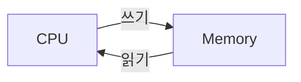

>컴퓨터란 하드웨어와 소프트웨어로 작동하는 연산장치이다. 
>컴퓨터는 사용자로부터 입력을 받고 프로그램으로 원하는 작업을 수행한 뒤 결과물을 출력해주는 과정을 거친다. 이 과정에는 핵심적인 두 장치가 있다. 바로 CPU와 메모리이다.
## 목차
[[#I. CPU와 메모리]]
[[#II. 비트와 바이트]]
[[#III. 이진법]]

---
## I. CPU와 메모리

#### CPU
CPU는 반도체인 트랜지스터의 전압을 조절해 전류가 흐르거나 흐르지 않는 상태를 만든다. 이 때 전류가 흐르는 상태를 1, 전류가 흐르지 않는 상태는 0으로 간주하여 논리 흐름을 만들고 연산을 수행한다.

#### 메모리
1945년에 고안된 혁신적인 폰-노이만 방식은 컴퓨터의 구조를 획기적으로 바꿨는데, 이 방식에서는 메모리라고 하는 주기억장치가 필수적인 요소로 작용한다.
메모리는 CPU가 연산할 데이터와 명령어를 저장하고, CPU는 메모리에 저장된 정보들을 불러와 연산을 수행한 뒤 그 결과를 다시 메모리에 저장한다. 이러한 과정이 프로그램이 끝날때까지 반복하는데, 핵심은 어떻게 연산을 수행할건지에 대한 명령어 역시 메모리에 저장한다는 것이다. 따라서 폰 노이만 방식은 다른 표현으로 '프로그램 내장 방식'이라고도 부른다.  
CPU가 메모리로부터 정보를 가져오는것을 '읽기', 메모리에 다시 저장하는것을 '쓰기'라고 부른다.

---
## II. 비트와 바이트
>CPU는 0과 1로 이루어진 이진수로 연산을 수행하는데, 연산의 기본 단위인 한 자리의 이진수를 '비트'라고 한다. 1바이트는 비트가 8개로 구성된 데이터 단위이며, 데이터의 크기를 표현하는 기본 단위이다.

32비트, 64비트 운영체제에서 비트 수의 의미는 CPU가 한번에 처리할 수 있는 데이터량을 말한다. 64비트 운영체제는 32비트 운영체제보다 한번에 더 큰 값을 연산할 수 있고, 더 광범위한 메모리 주소에 접근할 수 있다. 이 차이는 곧 컴퓨터의 성능으로 이어잔다.

자료형의 크기 역시 바이트 수로 표현되며, 이 숫자는 프로그래밍에서 매우 중요한 지표가 된다. 개발자는 프로그램의 성능, 목적, 환경, 사용자 등 여러 요소를 고려해 가장 적절한 자료형을 사용해야 한다.

|0|1|0|1|1|0|1|1|
|-|-|-|-|-|-|-|-|

---
## III. 이진법
>이진법은 0과 1로 수를 표현하는 체계이다. 십진수와 이진수는 숫자만 다를 뿐 그것을 해석하는 방법은 동일하다.

#### 진법에 대한 이해
십진수를 해석할 때 우린 '백의 자리', '십의 자리' 등 자리에 대한 표현을 사용한다. 이렇게 부르는 이유는 그 자리를 세는 단위가 곧 백, 십이기 때문이다.
십진수 112를 예로 들어보자. 백의 자리 1의 의미는 100이 1개 있다는 것이다. 마찬가치로 십의 자리 1은 10이 1개, 일의 자리 2는 1이 2개로 해석된다.

여기서 늘 익숙해서 지나쳐왔던 사실이 등장하는데, 바로 일의 자리부터 10의 거듭제곱수로 지수가 1씩 증가한다는 것이다. 일의 자리는 10의 0승, 십의 자리는 10의 1승, 백의 자리는 10의 2승...
즉 이진수도 마찬가지다. 첫번째 자리부터 2의 0승, 2의 1승... 이렇게 2에 지수가 붙어 0부터 시작해 1씩 증가한다. 

$$
\sum_{n=0}^{\infty}x*2^n(x = 0 또는 1)
$$
>[!info] 그래서 이진법에서는 이진수의 각 자리가 일의 자리, 이의 자리, 사의 자리, 팔의 자리.. 이렇게 2의 거듭제곱수로 표현된다. 그것이 그 자릿수를 세는 단위이기 때문이다.

#### 이진수 -> 십진수 변환
여기서부터 이진수는 매우 쉬워진다. 각 자릿수는 0 또는 1이다. 즉, 1부터 시작해 8, 16, 32.. 등등 2의 거듭제곱수가, 자릿수 1이냐 0이냐에 따라 있거나 없다는 것이다.
이 개념을 바탕으로 이진수 1010을 해석해보자. 자리가 네개이므로, 첫번째 자리 1부터 네번쨰 자리 8까지 이어진다.
- 1: 8의 자릿수. 있음.
- 0: 4의 자릿수. 없음.
- 1: 2의 자릿수. 있음.
- 0: 1의 자릿수, 없음.

즉 1010은 8과 2로 이루어진 수, 10이 된다. 이것을 수식으로 표현하자면 다음과 같다.

$$
2^3*1+2^2*0+2^1*1+2^0*0
$$
$$
= 8 + 0 + 2 + 0
$$
$$
=10
$$

#### 십진수 -> 이진수 변환
십진수를 다시 이진수로 표현하려면 망설여질 수 있다. 여기서 도움이 되는 발상은 '어떤 2의 거듭제곱수들이 있을까'이다.

10은 8, 2로 이루어질 수 있다. 근데 4, 4, 2로 이루어져 있다고 생각할 수도 있다. 하지만 명심하자. 이진수는 0과 1로 표현되므로, 서로 다른 2의 거듭제곱수들이 최대 하나씩 있거나, 없어야 한다는 것이다.

143이란 숫자를 생각해보자. 가장 큰 2의 거듭제곱수를 찾으려면 어떻게 해야 하는가? 143과 가장 가까운 2의 거듭제곱수인 128을 떠올려도 되지만, 간단하게 그냥 2로 나누어보면 된다.

- 143 ÷ 2는 몫이 71, 나머지 1
- 71 ÷ 2는 몫이 35, 나머지 1
- 35 ÷ 2는 몫이 17, 나머지 1
- 17 ÷ 2는 몫이 8, 나머지 1
- 8 ÷ 2는 몫이 4, 나머지 0
- 4 ÷ 2는 몫이 2, 나머지 0
- 2 ÷ 2는 몫이 1, 나머지 0

7번의 나눗셈을 끝으로 계산을 마쳤다. 어떤 수가 2로 7번 나누어졌음의 의미는, 그 수에 2의 7승 하나가 들어있음을 의미한다. 마지막 몫 1은 바로 그것을 의미한다. 그리고 나눈 순서의 역순으로 나머지가 자릿수가 된다. 이로서 십진수에서 이진수로의 변환이 끝난다. 143 = 10001111 

>[!faq] 왜 나머지를 자릿수로 표기할까? 
나머지 0은 '나누어 떨어졌음' 의미하는데, 그건 더 큰 거듭제곱수로 이어진다는 뜻이다. 예를 들어 8은  2의 3승인 8의 자리까지 2의 거듭제곱이 계속 이어진다. 그래서 8은 100으로 표기된다. 
나머지 1은 '나누어 떨어지지 않았음'을 의미하는데,  즉 거듭제곱수를 계속 이어갈 수 없으니, 한 자리 낮은 수를 추가하겠다는 것이다. 예를 들어 2로 7을 만들기 위해 2의 거듭제곱을 이어가다 보면 보면 4에서 멈춘다. 여기까지 100(4)다. 남은건 3인데, 이것도 2에서 멈춘다. 즉 100(4) + 10(2)이다. 가장 마지막에 남은건 1이므로 일의 자리에 1을 채워준다. 그래서 7은 111로 표기된다.

#### 2의 보수법
컴퓨터는 기본적으로 덧셈 기반 회로이기 때문에 뺄셈을 직접 수행하지 못한다. 따라서 이진수로 음수를 표현해 덧셈을 수행해야 한다.
2의 보수법은 마이너스 기호 없이 음수를 표현하는 방법이다. '보수'란 합해서 어떤 수가 되기위한 다른 수를 말하는데, '2의 보수'는 합해서 큰 2의 거듭제곱수가 되기 위한 다른 수를 말한다.

예를 들어, 10에 대한 2의 보수는 6이 된다.
$$
10 + 6 = 16 = 2^4
$$
$$
1010 + 110=10000
$$
2의 보수법에 의한 음수 표현에 따르면, 6은 -10으로 취급될 수 있다. 그것이 어떻게 가능할까?
그 원리가 와닿기 위해서는 우리에게 익숙한 십진수로 예시를 들어봐야 한다.
십진수 12에 대한 10의 보수는 88이 될 것이다. 합해서 100이 되기위한 다른 수이기 때문이다.
12 + (- 12) = 0이고, 12 + 88은 100이다. 즉 가장 높은자리를 제외하고 다른 자리가 전부 0이 되는 원리를 이용한 것이다.
$$
12 + (-12) = 0
$$
$$
12 + 88 = 100
$$
핵심은 여기서 가장 높은 자릿수인 1을 무시해야 한다는 것이다. 이진수의 경우, 컴퓨터에 어떤 수를 표현하기 위한 8개의 비트가 있다면 첫 번쨰 비트는 음수임을 알리는 부호로서 작용한다. 따라서 나머지 7개의 비트만으로 실제 수를 표현한다.

이제 이진수에서 2의 보수를 구해보자. 4개의 비트가 있고, 최상위 비트는 부호이며 나머지 3개의 비트가 실제 수라고 가정한다. 자릿수가 0이여도 무시하지 않고 계산에 포함하도록 유의해야 한다.

0110보다 한 자릿수 높은 2의 거듭제곱수, 10000에서 0110을 뺴면 2의 보수 1010이 얻어진다. 최상위 비트가 1이므로 음수로 취급되며, 그 값은 -0110이다.
$$
1000 - 0110 = 1010
$$
또는 0과 1을 반전시킨 뒤 1을 더해줘도 2의 보수를 구할 수 있다.
$$
0110 반전:1001
$$
$$
1001+1=1010
$$
이렇게 얻은 0110(6)애 대한 2의 보수 1010(-6)을 다른 수에 더해보자. 최상위 비트를 초과하는 자릿수는 무시된다.
$$
0111 +1010 =10001
$$
$$
7 + (-6)=1
$$
만약 계산 결과의 최상위 비트가 1이라면 여전히 음수라는 뜻이다. 즉 절대값이 보수보다 작은 양수를 더하거나, 음수와 음수를 더한 경우이다. 이 경우 다시 보수법을 취해 어떤 수의 음수인지 구해야한다.
$$
0101 +1010 =1111
$$
$$
C(1111)=0001
$$
$$
5+(-6)=-1
$$
즉 1111은 0001에 대한 2의 보수이므로, -1 값이다. 

