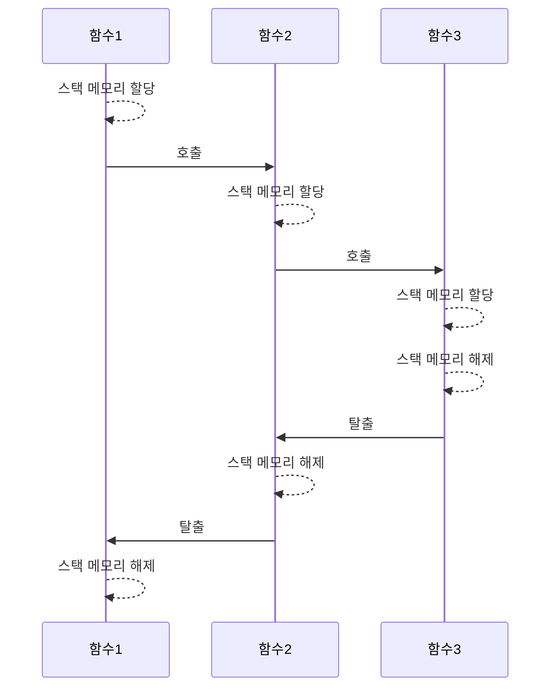
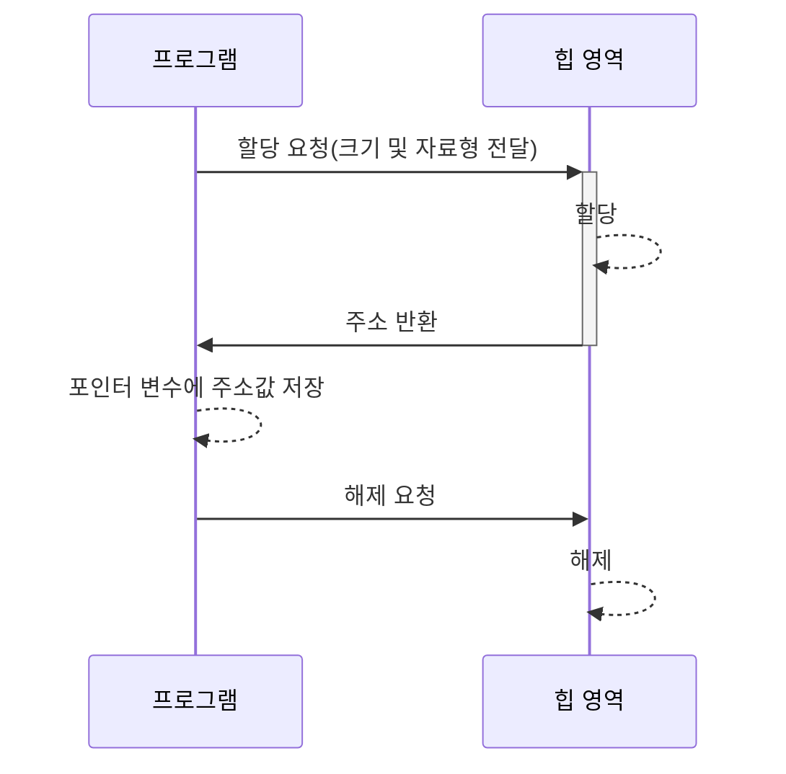

[[#I. 메모리 구조]]
[[#II. 배열]]
[[#III. 포인터]]

---
## I. 메모리 구조

>메모리는 <span style="font-size:17px; font-weight:bold; font-weight:bold">데이터 영역, 힙 영역, 스택 영역</span>으로 구분할 수 있다. 프로그램이 시작되면 이 세가지 영역이 RAM에 만들어지고, 각 영역의 목적에 따라 작동하게 된다.

![[68747470733a2f2f7065726665637461636c652e6769746875622e696f2f323031372f30322f30392f432d7265662d3030342f6d656d6f72792e706e67.png]]
#### 데이터 영역
컴파일 타임에 그 크기가 정해지고, <span style="font-size:17px; font-weight:bold; font-weight:bold">시작부터 종료까지 유지</span>되는 영역이다. 즉 <span style="font-size:17px; font-weight:bold; font-weight:bold">새로운 할당이나 해제가 발생하지 않는다.</span> 이 데이터 영역에는 다음과 같은 변수가 저장된다.
- <span style="font-size:17px; font-weight:bold">전역 변수</span>
함수 내부에 선언되지 않은, 가장 바깥쪽에 선언된 변수이다. 같은 소스파일이거나 헤더 파일에 선언이 포함되어있다면 <span style="font-size:17px; font-weight:bold">어디서든 접근</span>할 수 있다.
- <span style="font-size:17px; font-weight:bold">정적 변수</span>
static 키워드로 초기화된 변수이다. 함수 내에 선언되어 있다면 지역의 구분에 따라 접근하지 못할 수도 있지만, 그 <span style="font-size:17px; font-weight:bold">함수가 종료되더라도 값과 주소를 유지</span>한다.

>[!faq] 정적 전역 변수?
>전역 변수에 static 키워드를 붙이면 <span style="font-size:17px; font-weight:bold">정적 전역 변수</span>가 된다. 이러한 변수는 <span style="font-size:17px; font-weight:bold">같은 파일 내에서만 접근을 허용</span>한다. 전처리로 헤더 파일을 포함하더라도 말이다.
>이를 쓰는 이유는 <span style="font-size:17px; font-weight:bold">중복된 이름을 방지</span>하고 민감한 데이터를 <span style="font-size:17px; font-weight:bold">외부로부터 은닉</span>하기 위함에 있다. 

```c
int globalInt = 0; // 전역 변수
static int sgInt = 0; // 정적 전역 변수

void func1()
{
	static int staticInt = 0; // 정적 지역 변수(함수가 종료되어도 유지)

	// 전역 변수 접근 가능
	globalInt = 1;
	sgInt = 1;
}
```

#### 스택 영역
한 층씩 쌓아 올리며, 뺄 때는 위에서부터 빼는 후입선출 형태의 자료 구조를 <span style="font-size:17px; font-weight:bold">스택(stack)</span>이라고 부르는데, 스택 영역은 이 용어에서 비롯된 표현이다.
함수 호출 시 호출자 지역 위에 피호출자 지역이 쌓이고, 피호출자 함수가 탈출하면 호출자 지역으로 되돌아와 다음 명령어를 실행해 나간다. 이 과정에서 <span style="font-size:17px; font-weight:bold">크고 작은 메모리 공간의 할당과 해제</span>가 일어나는데, 이러한 스택 구조에 의해 할당/해제가 반복되는 메모리 영역을 <span style="font-size:17px; font-weight:bold">스택 영역</span>이라고 부른다.
이러한 스택 영역에서 일어나는 할당/해제의 과정은 함수뿐만 아니라 <span style="font-size:17px; font-weight:bold">조건문, 반복문에서도 동일하게 작동</span>한다. 

스택 영역은 <span style="font-size:17px; font-weight:bold">컴파일 시 그 크기가 미리 정해진다</span>는 특징이 있다. 정해진 크기 안에서 할당/해제가 일어날 뿐이기에 재귀 함수와 같은 알고리즘으로 반복적인 할당이 발생한다면 <span style="font-size:17px; font-weight:bold">스택 오버플로우가 발생할 위험</span>이 존재한다.

#### 힙 영역
개발자의 의도에 따라 <span style="font-size:17px; font-weight:bold">자유로운 할당/해제</span>가 이루어지는 메모리 영역이다. 스택 메모리 영역은 시스템이 정한 규칙과 크기를 따라야 하지만, 힙 메모리 영역은 <span style="font-size:17px; font-weight:bold">필요에 따라 원하는 시점에 할당/해제</span>가 가능하다.
프로그램은 할당과 해제를 위해 프로그램 실행 중에도 주소값을 통해 메모리와 실시간으로 직접 소통한다. 이러한 작업을 <span style="font-size:17px; font-weight:bold">동적 메모리 관리</span>라고 부르며, 힙 영역 역시 그 크기가 실시간으로 변하므로 <span style="font-size:17px; font-weight:bold">동적 메모리 영역</span>이라고 부른다.
>[!tip] 힙 영역은 매우 중요하다.
>어떤 프로그램이든 처음부터 모든 데이터를 가지고 시작하지 않는다. 계산기 같은 간단한 프로그램도, 사용자가 얼마나 많은 계산을 할건지에 따라서 계산 결과를 저장할 메모리 크기는 천차만별이다. 처음부터 최대 200개의 계산 결과까지만 저장할 수 있도록 프로그램을 만든다면, 한두개의 간단한 계산만 하고 끝내는 사람에겐 메모리 낭비이며, 수백 수천개를 계산하는 사람에게는 턱없이 부족하다. 
>프로그램이란 <span style="font-size:17px; font-weight:bold">다른 사용자라도 동일한 기능을 보장하는 것이 첫 번째 목적</span>이기에, 힙 영역을 잘 활용함으로서 필요에 맞게 메모리를 관리하는 작업은 매우 중요하며, 이는 프로그램의 근간을 다지는 일이다.


---

## II. 배열

><span style="font-size:17px; font-weight:bold">배열</span>은 <span style="font-size:17px; font-weight:bold">연속된 메모리 주소로 할당된 변수 집합</span>이다. 16진수로 표현되는 메모리 주소를 자료형의 크기만큼 연속적으로 지정하여 배열의 공간을 만든다. <span style="font-size:17px; font-weight:bold">인덱스를 이용한 산술 연산</span>으로 원하는 위치에 <span style="font-size:17px; font-weight:bold">빠르게 접근</span>할 수 있으며 선언과 사용이 간결하다.

배열은 다음과 같이 선언한다.
```c
int arr2[5] = { 1, 4, 2, 3, 2 }; // 초기화 선언: 직접 크기 지정
int arr3[] = { 1, 4, 2, 3, 2 };  // 초기화 선언: 자동 크기 지정
int arr1[10];					 // 미초기화 선언: 크기 지정 필수
int arr4[128] = { 0, };			 // 초기화 선언: 모든 값을 0으로 초기화
```

배열의 사용은 다음과 같다.
```c
int iArr[20] = { 0, };

iArr[12] = 1;	  // 배열의 특정 값 수정
int i = iArr[12]; // 배열의 특정 값 읽기
```

>[!tip] 배열 이름은 첫 번째 인덱스의 메모리 주소이다.
>배열 접근 연산은 첫번째 메모리 주소 + (자료형 크기 * 인덱스) 이다. 그렇기 때문에 배열 변수를 [n]과 같은 인덱스를 지정하지 않으면 그 자체로 메모리 주소를 갖는다. 이는 곧 <span style="font-size:17px; font-weight:bold">포인터 변수</span>라는 의미이다.

---

## III. 포인터

><span style="font-size:17px; font-weight:bold">포인터</span>란 <span style="font-size:17px; font-weight:bold">할당된 메모리 주소에 직접 접근</span>하는 방법으로, 이를 위해 <span style="font-size:17px; font-weight:bold">주소를 값으로 저장하는 포인터 변수</span>를 활용한다.

#### 포인터 변수 선언
\* 연산자를 활용해 포인터 변수를 선언할 수 있고, const 키워드와 조합해 포인터를 상수로, 또는 값을 상수로 만들 수 있다.
```c
int* ptr1;						  // 미초기화 선언
int* ptr2 = NULL;				  // NULL 초기화 선언
const int* c_ptr1 = NULL;		  // 포인터가 가리키는 값이 상수
int* const c_ptr2 = NULL;         // 포인터 자체가 상수
const int* const cc_ptr = NULL;   // 포인터와 가리키는 값 모두 상수
```

>[!warning] 포인터 변수 초기화 시 주의할 점
><span style="font-size:17px; font-weight:bold">미초기화 선언</span>은 대부분의 경우에서 <span style="font-size:17px; font-weight:bold">권장되지 않는다.</span> 임의로 중요한 데이터의 주소값으로 지정된다면 위험을 초래할 수 있기 때문이다.
><span style="font-size:17px; font-weight:bold">포인터 자체를 상수</span>로 하여 선언할 때, 초기화하지 않으면 컴파일 오류를 일으킨다. 다만 NULL로 초기화 시 어떻게도 활용할 수가 없는 변수가 되어버리므로, 프로그램에서 활용할 <span style="font-size:17px; font-weight:bold">유의미한 주소값으로 초기화</span> 해야한다.

#### 포인터 변수의 사용

- 연산자 <span style="font-size:17px; font-weight:bold">\&</span>: 일반 변수 앞에 오면 주소를 반환
- 연산자 <span style="font-size:17px; font-weight:bold">\*</span>: 포인터 변수 앞에 오면 실제 값을  반환 (역참조라고 표현함)

포인터 변수에 주소를 저장하는 과정은 다음과 같다.
```c
int* ptr;      // 포인터 변수 ptr
int num = 16;  // 일반 변수 num

ptr = &num; // num의 주소값을 ptr에 저장
*ptr = 8;   // 실제 값에 접근, 수정
```

\* 연산자를 포인터 변수 앞에 붙여 실제 값에 접근할 수 있다. 이것을 '역참조'라고 한다. 역참조를 사용하면 지역에 상관 없이 값에 직접 접근하여 처리할 수도 있다. 이는 대량의 데이터를 값 복사 없이 처리할 때 매우 유용하다.
```c
void ptrFunc(int* ptr)
{
	*ptr = 8; // 지역에 관계 없이 직접 접근
}
```

>[!faq] 포인터는 왜 사용할까?
>포인터는 <span style="font-size:17px; font-weight:bold">사물함</span>에 비유할 수 있다. 목욕탕에 가서 요금을 내면, 우린 물건을 담을 사물함을 통째로 받는것이 아니라 사물함의 특정 칸의 번호가 적힌 열쇠를 받는다. 사용자가 그 열쇠를 잃어버리지 않는 한, <span style="font-size:17px; font-weight:bold">얼마든지 자신의 사물함으로 찾아가 물건을 보관하거나 필요한걸 꺼낼 수 있다.</span> 포인터를 사용한다는 것은 바로 그런 의미이다. 이때 <span style="font-size:17px; font-weight:bold">번호가 적힌 열쇠는 포인터 변수</span> 그 자체라고 볼 수 있다.

