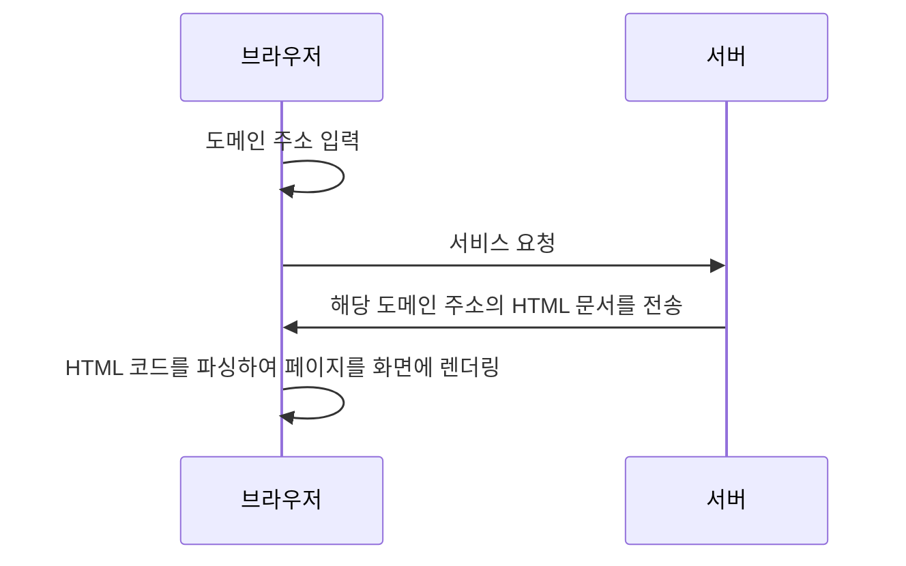
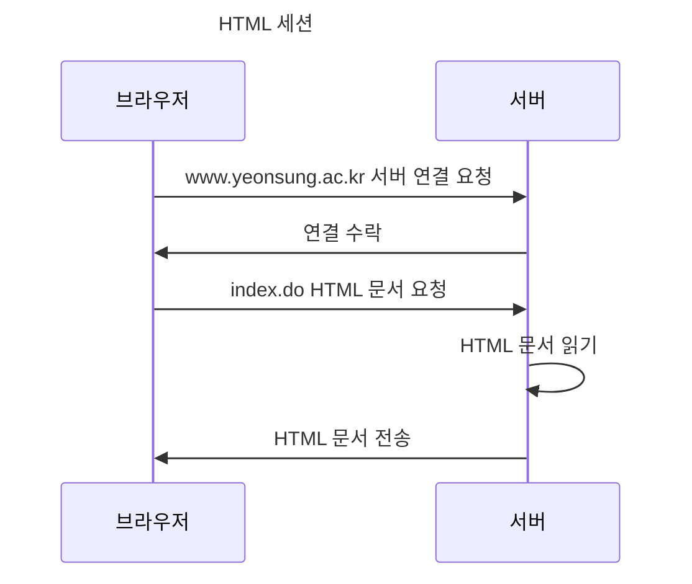
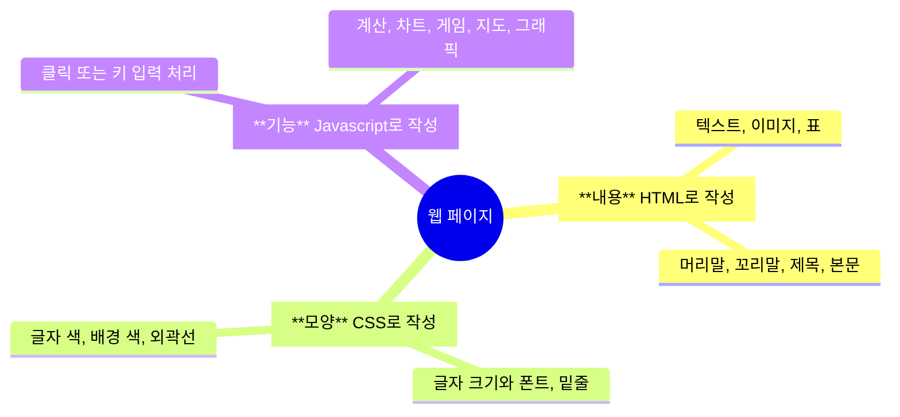
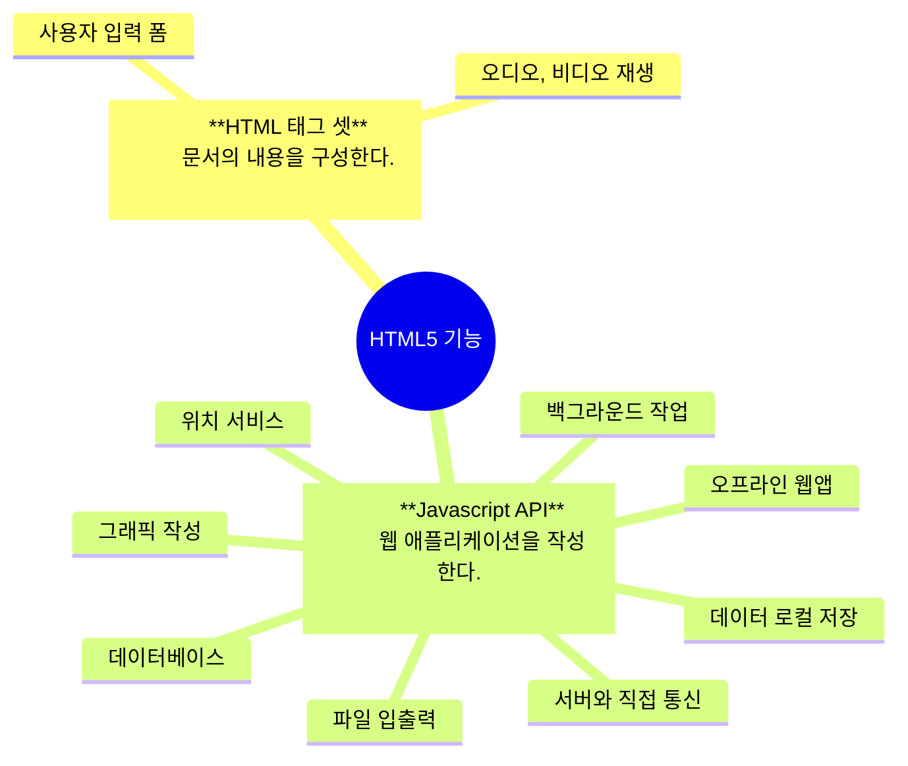

## 웹 개요

>웹이란, 한 컴퓨터에서 만든 문서를 다른 컴퓨터가 원격으로 볼 수 있도록 구축된 소프트웨어 시스템이다.
>월드 와이으 웹(www)이란 이름은 여러 컴퓨터가 마치 거미줄 망처럼 연결된 형태에서 고안되었다.  

인터넷 프로그램은 크게 두개의 단으로 나눌 수 있다.
- 웹을 서비스하는 서버 단
- 서비스받은 웹을 사용하는 클라이언트 단
여기서 우리가 자주 사용하는 **인터넷 브라우저는 여러 클라이언트 종류 중 하나**로 볼 수 있다.

웹이 서비스되는 과정은 다음과 같다.


>[!caution] 주의할 점
>도메인 주소에 오타가 있으면, 서버에서 해당 주소의 HTML 문서를 찾지 못해 오류가 발생함.
---
## URL

웹페이지의 주소 URL은 웹 문서에 접근하기 위한 여러 정보가 포함되어 있다.

https://www.yeonsung.ac.kr/ko/index.do

| 프로토콜     | 서버 주소               | TCP/IP 포트 번호 | 웹 문서 경로 | 파일 이름      |
| -------- | -------------------- | ---------------- | ------- | ---------- |
| https:// | www .yeonsung.ac.kr | :80              | /ko/  | index.do |

>[!faq] TCP/IP 포트 번호란?
>은행의 창구 번호와 유사하다. 웹 사이트에서 포트마다 서비스의 종류가 다르기에 이를 구분하는 번호이다. 일반적으로 80이기에 생략되어있다.
---
## HTTP

> 웹 브라우저의 서버의 통신 방법으로, 하나의 세션에 하나의  HTML 파일만 전송된다는 특징이 있다.


스테이트리스: 하나의 세션이 종료된 이후에는 브라우저와 서버의 연결이 끊어지는 HTTP의 특성. 비용의 손실을 최소화하기 위함임.
세션 트래킹: 로그인한 클라이언트에 한정하여, 연결을 끊더라도 이전에 연결한 사용자임을 기억하기 위한 기술.

---
## WEB 1.0 ~ WEB 3.0
web1.0: 1990~2004
- 읽기 전용 웹
- 소비자와 공급자의 엄격한 구분
- 단순한 서비스 양상ㄴ
web 2.0: 2004~
- 소셜 미디어의 등장(페이스북, 유튜브 ...)
- 양방향 소통(읽기, 쓰기)
- 여전히 중앙 집중식 네트워크로, 독점 구조를 띄우고 있음
web 3.0: 2020~
- 시멘틱 웹: 웹이 인공지능 기술을 접목시킨 것으로, 컴퓨터가 단어, 문장의 뜻을 이해하고 논리적으로 추론해 사용자에게 맞춤형 서비스를 제공하는 웹
- 탈중앙화: 데이터를 일부 사익집단이 독점하지 않는 구조로, 웹 서비스를 이용하는 과정에서 발생한 데이터와 재정적 보상을 온전히 사용자에게 돌아오는 형태. 즉 블록체인

>[!faq] 블록체인이란?
>데이터를 각 노드, 데이터를 만드는 데 참여한 사용자들의 컴퓨터에 분산 저장하는 기술로, 데이터의 독점을 막고 모든 사용자들이 데이터를 열람할 수 있다는 점에서 무결성을 확보할 수 있으며,  블록들 중 하나라도 수정하기 위해선 과반수의 동의가 필요하다는 점에서 해킹 등의 공격에도 위험 부담이 적다. 

WEB 3.0의 예시
- 암호화폐
- NFT
---
## 웹 피이지 구성

#### 웹 피이지 구성 3요소
- 구조와 내용: HTML로 작성
- 모양: CSS로 작성
- 행동 및 응용 프로그램: Javascript로 작성

세 가지 구성요소에 유의하여 분리 개발하는것이 좋다.

---
## 웹 페이지 개발 3단계

#### 1. HTML 태그로 내용 작성
```html
<!DOCTYPE html>
<html>
    <head>
        <title> 웹 프로그래밍 테스트 </title>
    </head>
    <body>
        <h3> 웹 페이지 구성 3요소 </h3> <hr>
        웹 페이지는 내용, 모양, 기능으로 분류된다.
    </body>
</html>
```


#### 2. CSS로 모양 만들기
CSS 코드는 head 영역에 style 태그로 작성된다.
```html
<!DOCTYPE html>
<html>
    <head>
        <title> 웹 프로그래밍 테스트 </title>
        <style>
            body {
                background-color: black;
                color: white;
                margin-left: 60px;
                margin-right: 60px;
            }
            h3 {
                text-align: center;
                color: red;
            }
            span {
                color: chocolate;
                font-size: 20px;
            }
        </style>
    </head>
    <body>
        <h3> 웹 페이지 구성 3요소 </h3> <hr>
        웹 페이지는 <span>내용, 모양, 기능</span>으로 분류된다.
    </body>
</html>
```
>[!tip] 팁
>인라인 요소에 span 태그를 이용해 따로 서식을 부여하기도 한다.


#### 3. Javascript 코드로 인터페이스 처리
js 코드 역시 head 영역에 작성하며, script 태그를 사용한다.
```html
<!DOCTYPE html>
<html>
    <head>
        <title> 웹 프로그래밍 테스트 </title>
        <style>
            body {
                background-color: black;
                color: white;
                margin-left: 60px;
                margin-right: 60px;
            }
            h3 {
                text-align: center;
                color: red;
            }
            span {
                color: chocolate;
                font-size: 20px;
            }
        </style>
        <script>
            var show = 0;
            function imageEvent() {
                if (show === 0) {
                    document.getElementById("i1").src="mindmap.png";
                    show = 1;
                }
                else {
                    image = document.getElementById("i1").src="";
                    show = 0;
                }                
            }
        </script>
    </head>
    <body>
        <h3> 웹 페이지 구성 3요소 </h3> <hr>
        웹 페이지는 <span onclick="imageEvent()">내용, 모양, 기능</span>으로 분류된다.
        <div></div>
    </body>
</html>
```
js로 클릭하면 웹 페이지 구성요소에 대한 마인드맵 이미지가 나타나고, 다시 클릭하면 사라지는 식으로 '기능'을 구현하였다.

![[20250317220323.png | 클릭 전]]
![[20250317220339.png | 클릭 후]]

---


## HTML
>프론트엔드 개발에 사용되는 마크업 언어로, 웹 페이지의 구조, 양식, 텍스트, 콘텐츠 등을 배치하고 브라우저 화면에 렌더링한다.

#### 역사
1. HTML 탄생 이후 웹 브라우저 전쟁 시작
2. MS스의 익스플로러의 승리로 끝났지만, 비표준 기술의 플러그인이 마구잡이로 도입, 호환성 저하
3. 스마트폰, TV 등 인터넷 기기가 다양해서, 높은 호환성의 표준 기술의 도입이 시급해짐
4. 별도의 플러그인 없이 모든 브라우저에서 호환되는 범용 웹 표준의 개발이 시작됨
5. W3C와 WHAT WG가 협업하여 HTML5 표준을 제정함

#### HTML5 표준에서 나타난 변화
- 웹 구성 3요소를 고려, '구성과 내용'이라는 역할에 충실하도록 불필요한 태그를 줄였다.
- 웹 문서 구성을 명확히 하는 시멘틱 태그의 도입으로 명확성과 편의성을 확보하였다.
- 외부 플러그인 없이 멀티미디어가 작동하도록 개선되었다.
- js 작성이 수월해졌다.
- 웹 애플리케이션 작성 기능이 추가되었다.
>[!success] 결과
>장치 의존성을 줄이는데 성공함

#### HTML5 표준의 기능

[^2]: 웹 구성 3요소에 맞게 분리 개발되도록, 기존 HTML에서  불필요한 태그를 삭제하고 구성을 명확히 하는 태그를 도입함. 외부 플러그인 없이 멀티미디어가 작동하도록 했으며 웹 애플리케이션을 작성할 수 있는 기능도 포함함. 자바 스크립트 작성을 쉽게 만듦.

prettier - code formatter
html css support
java script code snippets
auto rename tag
thml css autocompletion


---

로컬호스트: 아이피 주소로 호스팅

HTML 태그들
```html
<!DOCTYPE html> 

```