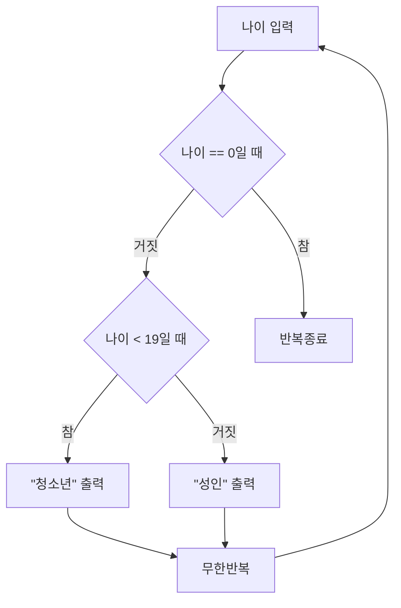

---

## 1번 - 용어 숙지 문제
>[!info] 출제 방향
> - 지금까지 배운 프로그래밍 관련 용어 10여 개 개념 설명
예) 인터프리터, 컴파일러, 변수, 상수 등등등
> - 정수, ASCII, 수표현 알기

#### 대비 문항

<span style="font-size:17px; font-weight:bold;">프로그램</span>
-  명령어들의 집합

<span style="font-size:17px; font-weight:bold;">3세대 고급 언어</span>
- 일상생활에서 쓰이는 영어를 이용하여 간결하게 명령어로 만든 언어

<span style="font-size:17px; font-weight:bold;">컴파일러</span>
- 고급 언어로 작성된 코드를 마치 번역기처럼  컴퓨터가 이해할 수 있는 언어로 바꿔주는 프로그램

<span style="font-size:17px; font-weight:bold;">인터프리터와 컴파일러의 차이</span>
- 인터프리터는 코드를 한 줄씩 번역하며 실행하고, 컴파일 언어는 전체 코드를 한번에 기계어로 번역해 실행파일을 만든 후 실행한다.

<span style="font-size:17px; font-weight:bold;">변수</span>
- 값을 저장하는 기억 공간, 그 공간에 의미있는 이름을 붙인 것

<span style="font-size:17px; font-weight:bold;">자료형(데이터형)</span>
- 실세계의 다양한 데이터를 컴퓨터 안에서 표현하는 방식

<span style="font-size:17px; font-weight:bold;">상수</span>
- 값이 변하지 않는 데이터
- \#define PI 3.14를 하게 되면 상수 3.14에 PI라는 이름을 붙인 것

<span style="font-size:17px; font-weight:bold;">비트와 바이트</span>
- 비트는 0 또는 1로 표현될 수 있는 데이터의 가장 작은 단위이고, 바이트는 비트 8개를 모아놓은 것

<span style="font-size:17px; font-weight:bold;">2진수와 16진수</span>
- 2진수는 0과 1, 두 가지의 숫자로 수를 표현하는 체계
- 16진수는 숫자 0부터 9, 문자 A부터 F로 수를 표현하는 체계

<span style="font-size:17px; font-weight:bold;">아스키코드</span>
- American Standard Code for Information Interchange: 미국정보교환표준부호
- 아라비아숫자, 영문자, 특수문자를 7개의 비트로 표현가능한 수 범위 안에 다 담은 것

---

## 2번 - 연산자 이해 문제
>[!info] 출제 방향
> - 연산자가 섞여있는 연산식 계산하기
> - 산술ㆍ비교ㆍ논리 연산이 섞여있음
> - 연산의 종류 및 우선순위 숙지 필요

#### 대비 문항 1
다음 예제의 출력 결과는?
```c
#include <stdio.h>
int main(void)
{
	int a = 10;
	int b = 20;

	if (a * (b + 6) / (3 * a) < a + ((b - 6) + a) && a * b / 2 + a > b / 2 % 2 + b)
	{
		printf("Hello");
	}
	else
	{
		printf("World");
	}

	return 0;
}
```

#### 대비 문항 1 - 해설
<span style="font-size:17px; font-weight:bold;">1. 괄호 먼저 계산(가장 안쪽 괄호부터)</span>
```c
	if (a * 26 / 30 < a + 24 && a * b / 2 + a > b / 2 % 2 + b)
	{
		printf("Hello");
	}
	else
	{
		printf("World");
	}
```
<span style="font-size:17px; font-weight:bold;">2. 곱셈, 나눗셈, 나머지 계산(왼쪽부터 순서대로)</span>
```c
	if (8.6666 < 34 && 100 + a > b)
	{
		printf("Hello");
	}
	else
	{
		printf("World");
	}
```
<span style="font-size:17px; font-weight:bold;">3. 덧셈 뺄셈 계산(왼쪽부터 순서대로)</span>
```c
	if (8.6666 < 34 && 110 > 20)
	{
		printf("Hello");
	}
	else
	{
		printf("World");
	}
```
<span style="font-size:17px; font-weight:bold;">4. 비교 연산자 계산</span>
```c
	if (1 && 1)
	{
		printf("Hello");
	}
	else
	{
		printf("World");
	}
```
<span style="font-size:17px; font-weight:bold;">5. 논리 연산자 계산</span>
```c
	if (1)
	{
		printf("Hello");
	}
	else
	{
		printf("World");
	}
```
<span style="font-size:17px; font-weight:bold;">출력 결과</span>
Hello

#### 대비 문항 2
다음 예제의 출력 결과는?
```c
#include <stdio.h>
int main(void)
{
	int a = 10;
	int b = 20;

	a = --a + b++;
	printf("%d %d", a, b);

	return 0;
}
```
#### 대비 문항 2 - 해설
<span style="font-size:17px; font-weight:bold;">1. 변수 앞 증감연산자를 가장 먼저 계산</span>
```c
#include <stdio.h>
int main(void)
{
	int a = 10;
	int b = 20;

	a = 9 + b++;
	printf("%d %d", a, b);

	return 0;
}

```
<span style="font-size:17px; font-weight:bold;">2. 산술 연산자 계산</span>
```c
#include <stdio.h>
int main(void)
{
	int a = 10;
	int b = 20;

	a = 9 + 20++;
	// a = 29
	printf("%d %d", 29, b);

	return 0;
}
```
<span style="font-size:17px; font-weight:bold;">3. 변수 뒤 증감연산자를 마지막에 계산</span>
```c
#include <stdio.h>
int main(void)
{
	int a = 10;
	int b = 20;

	a = 9 + 20++;
	// a = 29
	// b = 21
	printf("%d %d", 29, 21);

	return 0;
}
```
<span style="font-size:17px; font-weight:bold;">출력 결과</span>
29 21

---

## 3번 - 코드 해석 문제
>[!info] 출제 방향
> - 지금 배우고 있는 예제 프로그램에서 일부 문장 발췌 해 놓고 무슨 일을 하는 것인지 설명

#### 대비 문항 1
교재 예제 4-4, 138p
```c
#include <stdio.h>
#define PI 3.141592    

int main(void)
{
    int radius = 0;
    double area, perimeter;

    printf("반지름?");
    scanf("%d", &radius);
    area = PI * radius * radius;
    printf("원의 면적: %.2f\n", area);
    perimeter = 2 * PI * radius;
    printf("원의 둘레: %.2f\n", perimeter);
    return 0;
}
```
1. 코드 <span style="color:skyblue">\#define PI 3.141592</span> 는 어떤 일을 하는 것인가?
2. 코드 <span style="color:skyblue">int radius = 0;</span> 는 어떤 일을 하는 것인가?
3. 코드 <span style="color:skyblue">perimeter = 2 \* PI \* radius;</span> 는 어떤 일을 하는 것인가?
4. 포맷 지정자 <span style="color:skyblue">%.2f</span> 의 의미는?
#### 대비 문항 1 - 해설
1. <span style="color:skyblue">\#define</span> 전처리기 명령으로 <span style="color:skyblue">3.141592</span>라는 상수에 <span style="color:skyblue">PI</span>라는 의미있는 이름을 붙인다. 
2. <span style="color:skyblue">radius</span>라는 정수형 변수를 하나 선언하고 <span style="color:skyblue">0</span>으로 초기화한다.
3. <span style="color:skyblue">2</span>와 <span style="color:skyblue">PI</span>와 <span style="color:skyblue">radius</span>를 곱한 값을 <span style="color:skyblue">perimeter</span>라는 변수에 저장한다.
4. 실수형 값을 소숫점 둘째 자리까지 출력한다.

#### 대비 문항 2
교재 예제 5-4, 196p
```c
#include <stdio.h>

int main(void)
{
    int age, fee;

    printf("나이? ");
    scanf("%d", &age);

    if (age >= 8) {
        if (age >= 65) {
            fee = 5000;
        }
        else {
            fee = 10000;
        }
    }
    else {
        fee = 0;
    }
    printf("입장료: %d원\n", fee);

    return 0;
}
```
1. 이 문장은 어떤 일을 수행하는가?
```c
printf("나이? ");
scanf("%d", &age);
```
2. 이 문장은 어떤 일을 수행하는가?
```c
if (age >= 65) {
	fee = 5000;
}
else {
	fee = 10000;
}
```
3. 이 else의 의미는?
```c
else {
	fee = 0;
}
```

#### 대비 문항 2 - 해설
1. printf로 나이를 묻고 scanf로 정수 값을 입력받아 age 변수에 저장한다.
2. age가 65보다 크거나 같을 경우 fee에 5000 값을, 아닐 경우 fee에 10000 값을 저장한다.
3. 위의 if에서 판별하는 조건식인 age가 8보다 크거나 같다가 거짓인 경우, fee에 0 값을 저장한다.


---

## 4번 - 논리적 추론 문제
>[!info] 출제 방향
> - 조건문, 반복문 제시해 놓고 결과로 출력되는 값을 추론
> - 간단한 조건문 또는 반복문 이해ㆍ해석하기

#### 대비 문항 1
다음 예제의 출력 결과는?
```c
#include <stdio.h>
int main(void)
{
	int a = 0;
	int b = 0;
	int c = 0;

	for (int i = 0; i < 10; i++)
	{
		if (i % 2 == 0)
			a++;
		else if (i % 3 == 0)
			b++;
		else
			c++;
	}
	printf("%d %d %d", a, b, c);
	return 0;
}
```
#### 대비 문항 1 - 해설
<span style="font-size:17px; font-weight:bold;">1. 반복문 해석</span>
for는 조건의 대상이 되는 변수 하나와 그 변수의 변화를 매 루프마다 확인하며 실행.
i는 0부터 시작, 10보다 작을 때까지 1씩 증가시키겠다 -> i는 0, 1, 2, 3, ... 9까지 변하다가 반복문 종료
```c
	for (int i = 0; i < 10; i++) // i = 0, 1, 2, 3, ... 9
	{
		if (i % 2 == 0)
			a++;
		else if (i % 3 == 0)
			b++;
		else
			c++;
	}
```
<span style="font-size:17px; font-weight:bold;">2. 첫번째 조건 - if</span>
- if: 만약 2로 나눈 나머지가 0일 때 - >짝수일때를 의미(0포함)
즉 0, 2, 4, 6, 8일 때 걸리게 됨 -> 5번 걸리므로 a는 5
```c
	for (int i = 0; i < 10; i++) // i = 0, 1, 2, 3, ... 9
	{
		if (i % 2 == 0) // i = 0, 2, 4, 6, 8
			a++; 
		else if (i % 3 == 0)
			b++;
		else
			c++;
	}
```
<span style="font-size:17px; font-weight:bold;">2. 두번째 조건 else if</span>
- else: 첫번째 조건이 거짓일 때 -> 짝수가 아닐때를 의미
즉 0, 2, 4, 6, 8 제외
- if: 그때 그 수를 3으로 나눈 나머지가 0일 때 -> 짝수가 아니면서 3의 배수
즉 3, 9가 걸리게 됨 -> 2번 걸리므로 b는 2
```c
	for (int i = 0; i < 10; i++) // i = 0, 1, 2, 3, ... 9
	{
		if (i % 2 == 0) // i = 0, 2, 4, 6, 8
			a++; 
		else if (i % 3 == 0) // i = 3, 9
			b++;
		else
			c++;
	}
```
<span style="font-size:17px; font-weight:bold;">3. 세번째 조건 else</span>
- else: 첫번째 조건이 거짓, 두번째 조건도 거짓일 때 -> 짝수도 3의 배수도 아닐 떄
즉 0, 2, 3, 4, 6, 8, 9 제외
즉 1, 5, 7에서 걸리게 됨 -> 3번 걸리므로 c는 3

<span style="font-size:17px; font-weight:bold;">출력 결과</span>
5 2 3

#### 대비 문항 2
다음 예제의 출력 결과는?
```c
#include <stdio.h>

int main(void)
{
	float f1 = 0.15;
	float f2 = 0.0;
	int count = 0;

	while (f2 < 1)
	{
		f2 += f1;
		count++;
	}
	printf("%d", count);
	return 0;
}
```
#### 대비 문항 2 - 해설
<span style="font-size:17px; font-weight:bold;">1. 조건 해석</span>
while문을 언제 탈출?
-> f2가 1보다 크거나 같게 되면
```c
while (f2 < 1)
```
<span style="font-size:17px; font-weight:bold;">2. 루프 해석</span>
while문 안의 코드를 한번 수행할때마다 변하는 값?
1. f2: 0에서 출발하여 1.5씩 증가
2. count: 0에서 출발하여 1씩 증가

<span style="font-size:17px; font-weight:bold;">3. 하나씩 시뮬레이션 해보기</span>
f2는 0, 1.5, 3, 4.5, 6, 7.5, 9로 변함
그 다음은 10.5, while문의 조건이 false가 됨 -> 탈출
즉 루프를 7번 수행, count++도 7번 수행

<span style="font-size:17px; font-weight:bold;">출력 결과</span>
7


---

## 5번 - 순서도 해석 문제
>[!info] 출제 방향
> - 제시된 순서도가 어떤 일을 하는것인지 파악하고 그에 맞게 코딩

#### 대비 문항
다음 순서도에 맞게 코딩하시오.


#### 대비 문항 - 해설
```c
#define _CRT_SECURE_NO_WARNINGS
#include <stdio.h>

int main(void)
{
	int age;

	while(1)
	{
		printf("나이? ");
		scanf("%d", &age);
		if (age == 0)
			break;
		else
		{
			if (age < 19)
				printf("청소년\n");
			else
				printf("성인\n");
		}
	}
	return 0;
}
```
<span style="font-size:17px; font-weight:bold;">1. 무한 반복</span>
while()문의 조건식을 1로 하여 항상 참이 되도록 한다.
```c
while(1)
{
...
}
```
<span style="font-size:17px; font-weight:bold;">2. 입출력</span>
나이를 묻고 scanf로 정수값을 받아 age에 저장한다.
```c
printf("나이? ");
scanf("%d", &age);
```
<span style="font-size:17px; font-weight:bold;">3. 첫 번째 조건문</span>
0인지 아닌지를 판단하여 0이면 break로 무한반복을 탈출한다.
```c
if (age == 0)
	break;
else
{
...
}
```
<span style="font-size:17px; font-weight:bold;">4. else 안에 중첩된 두 번째 조건문</span>
19보다 작으면 "청소년"을, 크면 "성인"을 출력한다.
```c
if (age < 19)
	printf("청소년\n");
else
	printf("성인\n");
```

